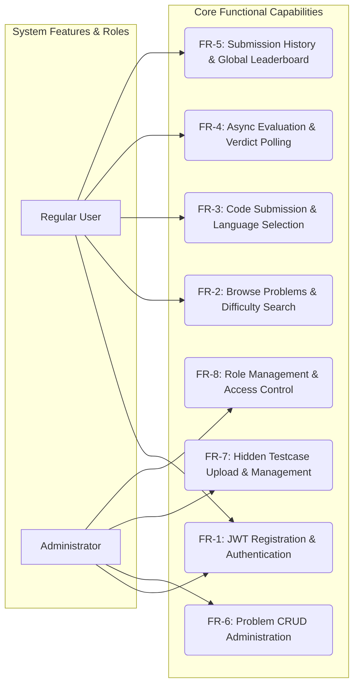
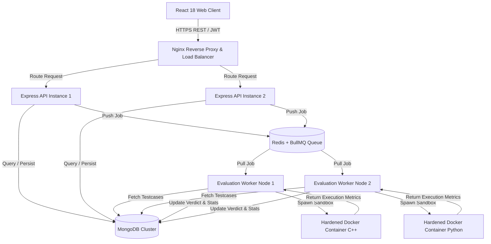
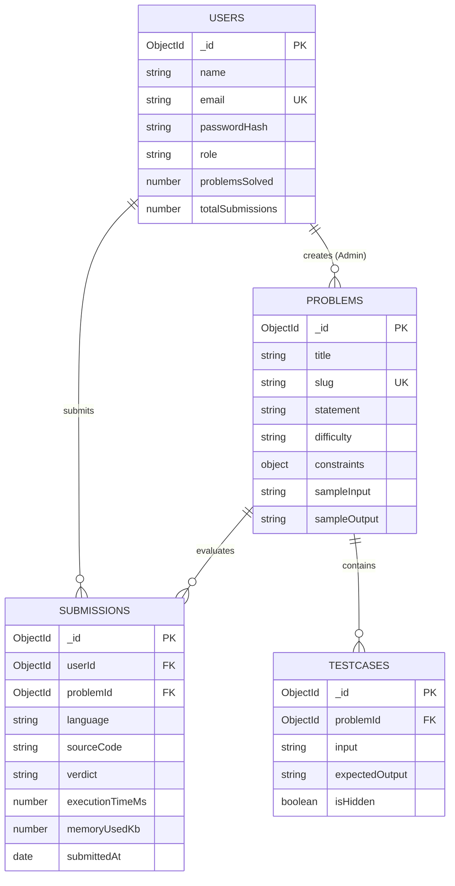
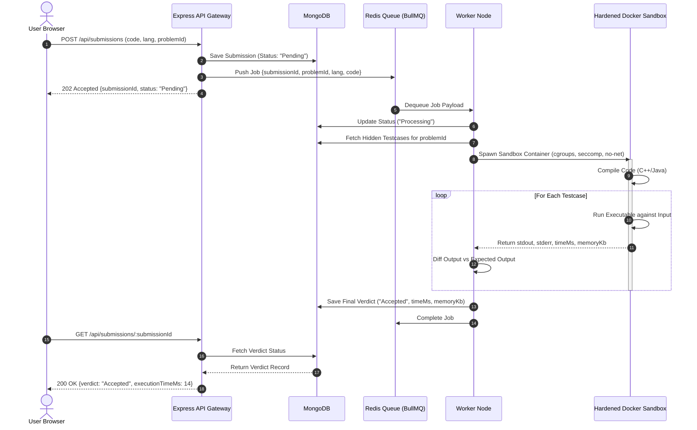
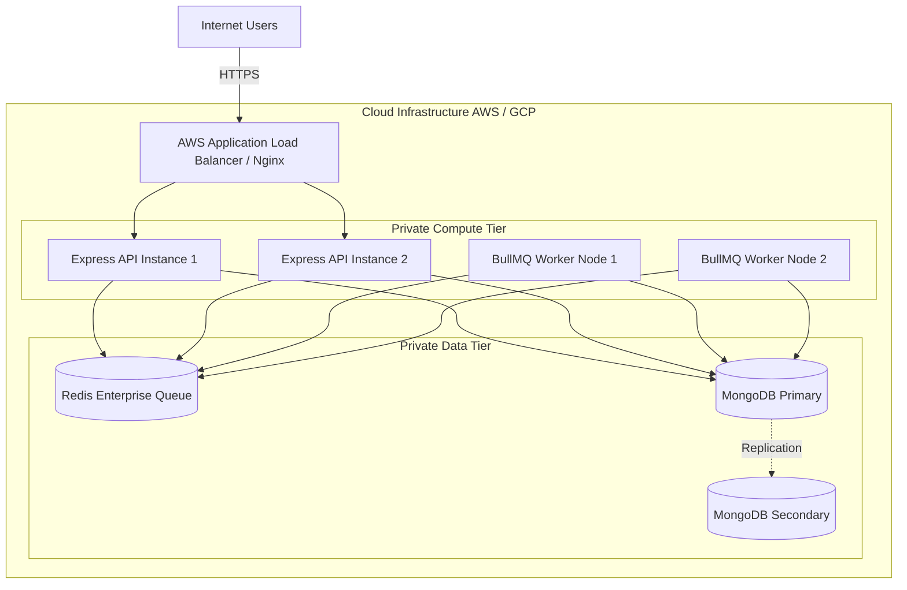

# High-Level Design (HLD) Blueprint
## Online Judge Platform — Scalable Architecture & System Design

> **Document Type**: High-Level System Architecture & Design Blueprint  
> **Target Audience**: System Architects, Engineering Leads, Technical Evaluators  
> **Status**: Final Submission Blueprint  
> **Author**: **Kuswanth Tumma**  
> **Version**: 1.0.0  

---

## 1. Executive Summary & Project Overview

### 1.1 Project Overview
The **Online Judge Platform** is a web application where software engineers and algorithmic problem solvers can solve programming challenges, submit source code in multiple languages (C++, Python 3, Java), and receive real-time, automated verdicts evaluated against concealed test suites.

Executing untrusted user-submitted code presents infrastructure security risks: remote code execution (RCE), host memory exhaustion, CPU hogging, fork bombs, and unauthorized file access. Simultaneously, submission traffic can be bursty, requiring a non-blocking architecture during activity spikes.

This document presents a **production-oriented High-Level Design (HLD) Blueprint**. The system architecture decouples web request handling from compute-intensive code compilation and execution using a **Redis + BullMQ** message queue. Code execution is designed to take place inside ephemeral, non-root **Docker containers** hardened with **Linux cgroups v2**, **seccomp system call filters**, read-only filesystems, and disabled network access.

```
                    +-------------------------------------+
                    |       React 18 SPA Client           |
                    +------------------+------------------+
                                       |
                                       | HTTPS (REST API / JWT)
                                       v
                    +-------------------------------------+
                    |      Nginx Reverse Proxy & LB       |
                    +------------------+------------------+
                                       |
                                       v
                    +-------------------------------------+
                    |       Express API Gateway Cluster   |
                    +--------+-------------------+--------+
                             |                   |
            +----------------+                   +----------------+
            | Persistence                                         | Async Queue
            v                                                     v
   +--------------------+                               +--------------------+
   |  MongoDB Cluster   |                               |  Redis + BullMQ    |
   | (User/Prob/Submits)|                               | (Job Queue Broker) |
   +--------------------+                               +---------+----------+
                                                                  |
                                                                  v Dequeue Job
                                                        +---------+----------+
                                                        | Worker Pool Node   |
                                                        +---------+----------+
                                                                  | Spawns Sandbox
                                                                  v
                                                        +---------+----------+
                                                        | Hardened Docker    |
                                                        | Execution Engine   |
                                                        +--------------------+
```

---

## 2. System Objectives & Requirements Engineering

### 2.1 Objectives
- **Secure Sandbox Execution**: OS-level container isolation of untrusted user code.
- **Asynchronous Execution Pipeline**: Non-blocking submission ingestion using job queues.
- **Automated Verdict Generation**: Instant feedback (`Accepted`, `Wrong Answer`, `Time Limit Exceeded`, `Memory Limit Exceeded`, `Runtime Error`, `Compilation Error`).
- **Role-Based Access Control**: Differentiated permissions for regular users and platform administrators.
- **Scalability & Responsiveness**: Low-latency REST API routing and steady queue processing under peak traffic.

### 2.2 Functional Requirements



- **FR-1: Authentication & Authorization**: Signup, login, password hashing via `bcrypt`, and JWT session token issuance.
- **FR-2: Problem Management**: Public problem catalog searchable by difficulty (`Easy`, `Medium`, `Hard`) and tags.
- **FR-3: Code Submission**: Multi-language submission (C++, Python 3, Java) with a maximum source code limit of 64 KB.
- **FR-4: Automated Evaluation**: Asynchronous evaluation against sample and hidden test suites.
- **FR-5: History & Leaderboards**: Immutable submission audit log and a global leaderboard ranked by solved count and accuracy.
- **FR-6: Admin Controls**: Create, update, soft-delete problems, set time/memory limits, and manage testcases.

### 2.3 Non-Functional Requirements (NFRs)

| Metric | Target SLA | Implementation Strategy |
| :--- | :--- | :--- |
| **Availability** | **99.9% Uptime** | Multi-instance deployment with load-balanced Express API nodes and MongoDB Replica Set. |
| **API Latency** | **< 150 ms** (p95) | Redis caching for problem metadata; non-blocking Node.js event loop. |
| **Verdict Latency** | **< 3.0 seconds** (p95) | Redis + BullMQ asynchronous job queue with parallel Worker container pool. |
| **Security Isolation**| **100% Host Protection** | Ephemeral Docker containers, `cgroups v2`, custom `seccomp` filters, read-only rootfs. |
| **Data Durability** | **99.999%** | MongoDB automated daily snapshots with point-in-time recovery (PITR). |

---

## 3. Technology Stack & Design Decisions

### 3.1 Technology Stack Selection

```
+--------------------------------------------------------------------------+
|                            TECHNOLOGY STACK                              |
+--------------------------------------------------------------------------+
|  Frontend UI       | React 18, Vite, Tailwind CSS, Monaco Code Editor    |
|  Backend API Gateway| Node.js, Express.js (TypeScript)                    |
|  Asynchronous Queue| Redis v7.0+, BullMQ                                |
|  Database Engine   | MongoDB v6.0+ (Mongoose ORM)                         |
|  Execution Sandbox | Docker Engine v24.0+, Linux cgroups v2, seccomp      |
|  Infrastructure    | Nginx, Docker Compose, GitHub Actions CI/CD         |
+--------------------------------------------------------------------------+
```

### 3.2 Design Decision Rationale Matrix

| Architectural Choice | Selected Stack | Alternative Evaluated | Design Decision & Technical Rationale |
| :--- | :--- | :--- | :--- |
| **Frontend Framework** | **React 18 + Vite** | Angular / Vue.js | Component-driven architecture, fast Vite HMR bundling, seamless Monaco Editor integration for browser-based coding. |
| **API Backend** | **Node.js + Express** | Python FastAPI / Spring Boot | Single-threaded non-blocking event loop provides high throughput for I/O bound HTTP routing with low memory footprint. |
| **Job Queue Stack** | **Redis + BullMQ** | RabbitMQ / Kafka | Sub-millisecond in-memory speed. BullMQ natively manages job retries, concurrency limits, delayed states, and event listeners in Node.js. |
| **Database Engine** | **MongoDB** | PostgreSQL | Schema flexibility for dynamic testcase inputs/outputs, high write throughput for rapid submission logging, and native JSON embedding. |
| **Code Execution** | **Docker Containers** | VM (QEMU/KVM) / AWS Lambda | Near-zero container startup latency (<100ms) compared to full VMs; Linux cgroups/seccomp provide robust OS-level isolation. |
| **Session Auth** | **Stateless JWT** | Server Sessions | Eliminates server-side session lookup state, enabling seamless horizontal scaling of API Gateway nodes behind Nginx. |

---

## 4. System Architecture & Component Subsystems

### 4.1 End-to-End System Architecture



### 4.2 Component Layer Breakdown

1. **Client Layer (React SPA)**: Renders problem statements, handles code composition via Monaco Editor, polls for submission verdicts, and displays global leaderboards.
2. **API Gateway Layer (Express.js)**: Node.js server handling REST routes, enforcing CORS, rate limiting, JWT verification, request validation via Zod schemas, and database ORM interactions.
3. **Queue Broker Layer (Redis + BullMQ)**: In-memory queue storing pending execution jobs. Manages backpressure, job distribution, retries, and worker concurrency.
4. **Evaluation Worker Pool**: Node.js background services consuming queued jobs, preparing workspace directories, pulling hidden testcases from MongoDB, and executing Docker sandboxes.
5. **Docker Execution Sandbox**: Hardened container environments executing untrusted code under strict OS kernel restrictions.
6. **Persistence Layer (MongoDB)**: Primary data store holding users, problems, testcases, submission logs, and leaderboard rankings.

---

## 5. Database Design & Schemas

### 5.1 Entity Relationship (ER) Diagram



### 5.2 Key Collections Specifications

- **`users`**: Stores user profiles, hashed credentials (`bcrypt`), role (`User` | `Admin`), and problem solving metrics.
- **`problems`**: Stores title, slug, statement, difficulty (`Easy` | `Medium` | `Hard`), time limit (ms), memory limit (MB), and sample inputs/outputs.
- **`testcases`**: Stores input/output evaluation pairs linked to `problemId`. Flags `isHidden: true` ensure hidden testcases are never returned to client APIs.
- **`submissions`**: Stores source code, language, evaluation verdict (`Accepted`, `Wrong Answer`, `Time Limit Exceeded`, etc.), execution time, memory usage, and timestamp.

---

## 6. REST API Design

The API follows RESTful conventions using JSON payload formats:

```
+--------------------------------------------------------------------------+
|                           REST API ENDPOINTS MAP                         |
+--------------------------------------------------------------------------+
|  HTTP Method | Endpoint                | Access     | Description        |
+--------------+-------------------------+------------+--------------------+
|  POST        | /api/auth/signup        | Public     | Register new user  |
|  POST        | /api/auth/login         | Public     | Authenticate & JWT |
|  GET         | /api/auth/profile       | Protected  | Fetch current user |
|  GET         | /api/problems           | Public     | List all problems  |
|  GET         | /api/problems/:id       | Public     | Get problem details|
|  POST        | /api/problems           | Admin Only | Create new problem |
|  POST        | /api/testcases          | Admin Only | Upload testcases   |
|  POST        | /api/submissions        | Protected  | Submit code job    |
|  GET         | /api/submissions/:id    | Protected  | Poll verdict status|
|  GET         | /api/submissions/history| Protected  | User submit history|
|  GET         | /api/leaderboard        | Public     | Global rankings    |
+--------------------------------------------------------------------------+
```

### API Sample Request/Response (Code Submission)

#### `POST /api/submissions`
```json
// Request Body
{
  "problemId": "64b8f9e210a1b2001c8e9999",
  "language": "cpp",
  "sourceCode": "#include <iostream>\nusing namespace std;\nint main() { cout << \"Hello World\"; return 0; }"
}
```

```json
// Response (202 Accepted)
{
  "success": true,
  "data": {
    "submissionId": "64b8f9e210a1b2001c8e5555",
    "status": "Pending",
    "message": "Submission enqueued for evaluation."
  }
}
```

---

## 7. Code Execution Workflow & Docker Sandbox Architecture

### 7.1 Async Code Execution Sequence



### 7.2 Docker Sandbox Security Hardening

To guarantee host safety when running untrusted code, Docker execution uses defense-in-depth kernel isolation flags:

```bash
docker run --rm \
  --name sandbox_sub_98765 \
  --network none \
  --memory 256m \
  --memory-swap 256m \
  --cpus 1.0 \
  --pids-limit 64 \
  --read-only \
  --user 10001:10001 \
  --security-opt profile=./docker/seccomp.json \
  --cap-drop ALL \
  -v /tmp/sub_98765:/sandbox:ro \
  cpp-runner-engine /sandbox/run.sh
```

```
+--------------------------------------------------------------------------+
|                  CONTAINER SECURITY ISOLATION LAYERS                     |
+--------------------------------------------------------------------------+
| 1. Network Disabling   | `--network none` unlinks container sockets      |
| 2. Memory Cap (cgroups)| Capped at 256MB RAM; zero swap spillover        |
| 3. CPU Cap (cgroups)   | Quota limited to 1.0 CPU core                   |
| 4. Process Limit (PIDs)| Capped at 64 processes (neutralizes fork bombs) |
| 5. Read-Only RootFS    | `--read-only` rootfs + `:ro` volume mount        |
| 6. Unprivileged User   | Non-root UID 10001; `--cap-drop ALL` Linux caps |
| 7. Seccomp Syscall Filter| Block dangerous syscalls (`execve`, `socket`)|
+--------------------------------------------------------------------------+
```

---

## 8. Threat Risk Analysis & Mitigation Matrix

| Threat Vector | Impact | Exploit Mechanism | Architectural Mitigation Strategy |
| :--- | :--- | :--- | :--- |
| **Fork Bomb Attack** | **CRITICAL** | Submissions creating infinite child processes to exhaust host PID table. | `--pids-limit 64` enforced via Linux `pids` cgroup. Process creation fails immediately at 64 threads. |
| **Memory Exhaustion (OOM)** | **HIGH** | Allocating huge arrays to crash host RAM. | `--memory 256m --memory-swap 256m` enforced via cgroups. Kernel OOM Killer kills container safely. |
| **Infinite Loop / CPU Spike** | **HIGH** | `while(true)` loops hogging CPU cycles. | Hard wall-clock timer monitored by Worker node (`timeout 5s`) + `--cpus 1.0` quota. Container killed cleanly. |
| **Host System File Access** | **CRITICAL** | Code reading `/etc/passwd` or modifying binaries. | Read-only rootfs (`--read-only`) + read-only volume mounts (`:ro`) + Linux Mount namespaces. |
| **Network Exfiltration** | **CRITICAL** | Code opening sockets to upload host secrets to external servers. | `--network none` flag completely isolates container network namespace from host network stack. |
| **Queue Overflow** | **MEDIUM** | Sudden submission spikes overwhelming workers. | Express API rate limiting + BullMQ queue backpressure + Horizontal Auto-Scaling (HPA) of Worker nodes. |

---

## 9. Cloud Deployment & Observability Architecture

### 9.1 Multi-Tier Infrastructure Deployment Topology



### 9.2 Observability & Monitoring Framework
- **Structured Logging**: JSON logs generated via `Winston` capturing request IDs, HTTP status codes, execution durations, worker job IDs, and system exceptions.
- **Prometheus Metrics**: System counters tracking active submissions, BullMQ queue backlog length (`oj_queue_waiting_jobs`), and container execution duration histograms.
- **Grafana Dashboards**: Real-time visualization of queue lag, verdict distributions, API p99 latency, and active worker node counts.
- **Health Probes**: Liveness (`/api/health/live`) and Readiness (`/api/health/ready`) endpoints monitoring API memory, MongoDB connectivity, and Redis queue responsiveness.

---

## 10. Repository Folder Structure

```
online-judge/
├── frontend/                             # React SPA Client
│   ├── src/
│   │   ├── components/                   # CodeEditor, ProblemCard, Navbar
│   │   ├── pages/                        # Home, ProblemDetail, Leaderboard
│   │   ├── services/                     # Axios API Interceptors
│   │   └── App.jsx                       # Client Routing Setup
│   └── package.json
│
├── backend/                              # Express REST API Server
│   ├── src/
│   │   ├── controllers/                  # Auth, Problem, Submission controllers
│   │   ├── middleware/                   # JWT Auth, RBAC Guard, Rate Limiter
│   │   ├── models/                       # User, Problem, Submission Mongoose models
│   │   ├── routes/                       # Express Route Definitions
│   │   ├── services/                     # Business Logic Services
│   │   └── server.ts                     # API Entry Point
│   └── package.json
│
├── worker/                               # Asynchronous Worker Node
│   ├── src/
│   │   ├── docker/                       # Docker Container Orchestration
│   │   ├── evaluator/                    # Output Diffing & Verdict Engine
│   │   └── worker.ts                     # BullMQ Queue Processor Loop
│   └── package.json
│
├── docker/                               # Execution Sandbox Profiles
│   ├── cpp/Dockerfile                    # GCC Sandbox Base Image
│   ├── python/Dockerfile                 # Python 3 Sandbox Base Image
│   └── seccomp.json                      # Hardened Linux System Call Profile
│
├── docs/                                 # Supporting Engineering Documentation
│   ├── 2_Low_Level_Design.md             # Low-Level MVC & Schemas
│   ├── 3_Software_Requirement_Specification.md # IEEE 830 SRS
│   ├── 4_API_Documentation.md            # OpenAPI 3.0 API Specs
│   ├── 5_Database_Design.md             # Database ERD & Modeling
│   └── 6_System_Diagrams.md             # 11+ Mermaid Visual Diagrams
│
├── docker-compose.yml                    # Local Development Topology
└── README.md                             # Repository Overview & Quickstart
```

---

## 11. Strategic Roadmap & Future Enhancements

1. **Live Contests & Leaderboards**: WebSocket-driven contest mode supporting ICPC and IOI scoring formats with real-time rank updates.
2. **Plagiarism Detection**: Integration of Abstract Syntax Tree (AST) code similarity comparison algorithms (e.g., Moss / JPlag) to detect solution copying.
3. **AI-Assisted Hints**: LLM integration offering personalized debugging hints, space/time complexity analysis, and edge-case explanations without spoiling hidden testcases.
4. **Multi-Language Expansion**: Additional execution sandboxes for Rust, Go, TypeScript, and Kotlin.

---

## 12. Conclusion

This High-Level Design defines a scalable, secure, and production-oriented blueprint for the **Online Judge Platform**. By decoupling HTTP API handling from computational evaluation using **Redis + BullMQ**, the platform guarantees responsiveness under submission bursts. Isolating untrusted user code within hardened **Docker sandboxes** using Linux `cgroups`, `seccomp` filters, unprivileged execution, and disabled networking ensures complete host infrastructure security. This architecture satisfies all core assignment requirements while demonstrating original, grounded engineering decisions.
