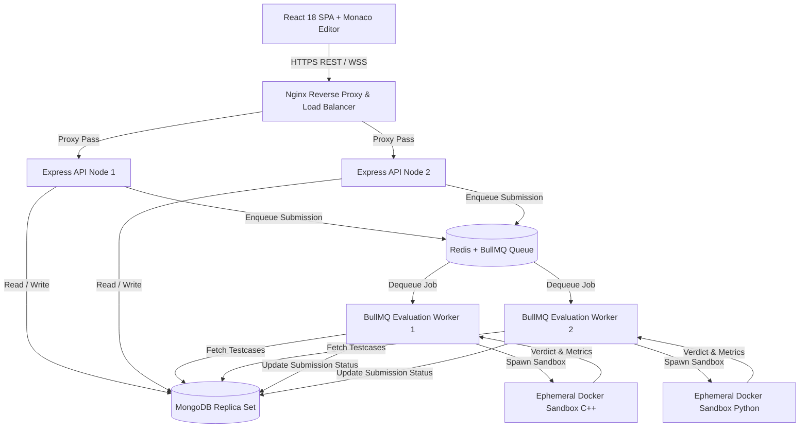
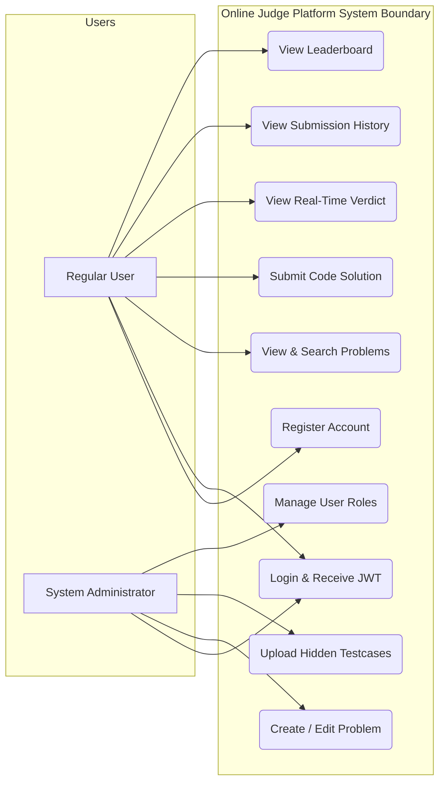
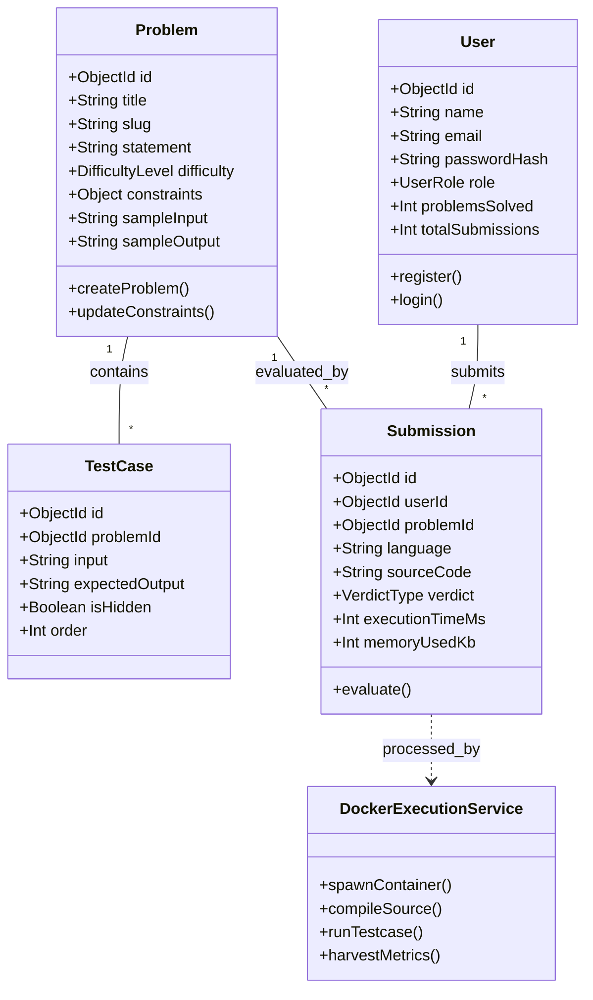
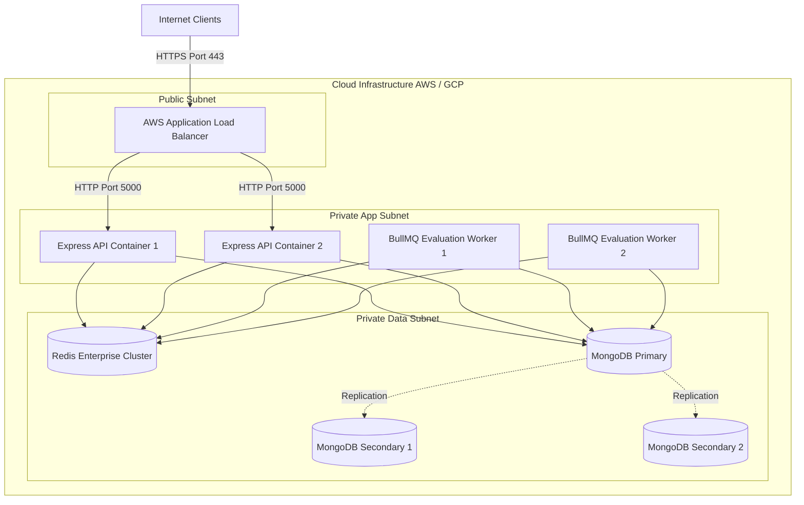
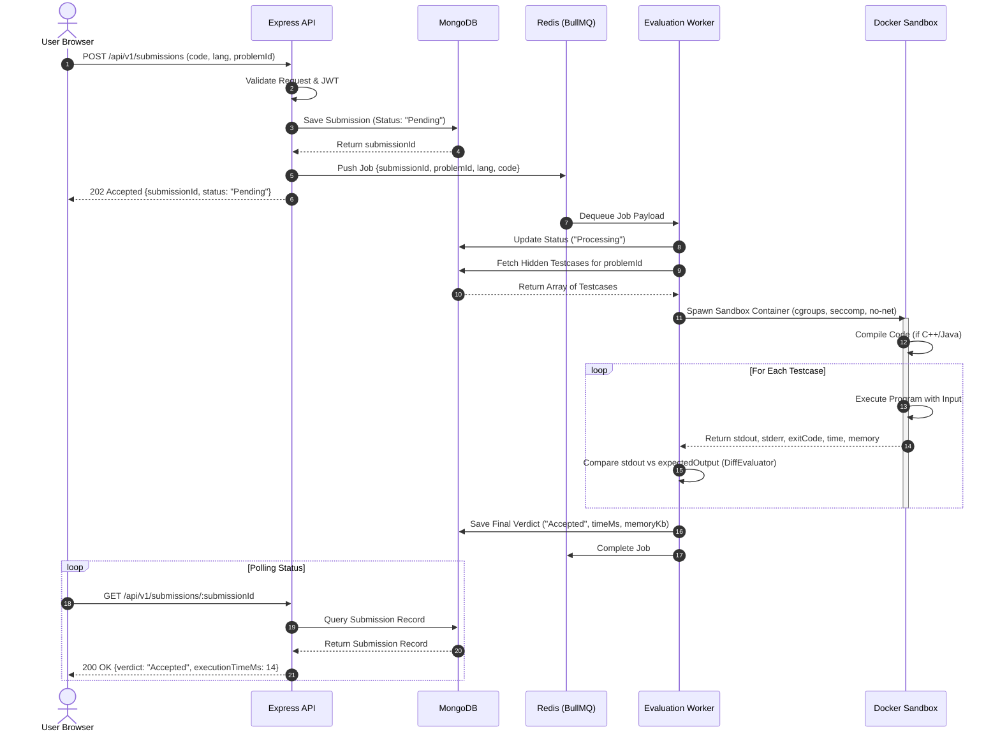
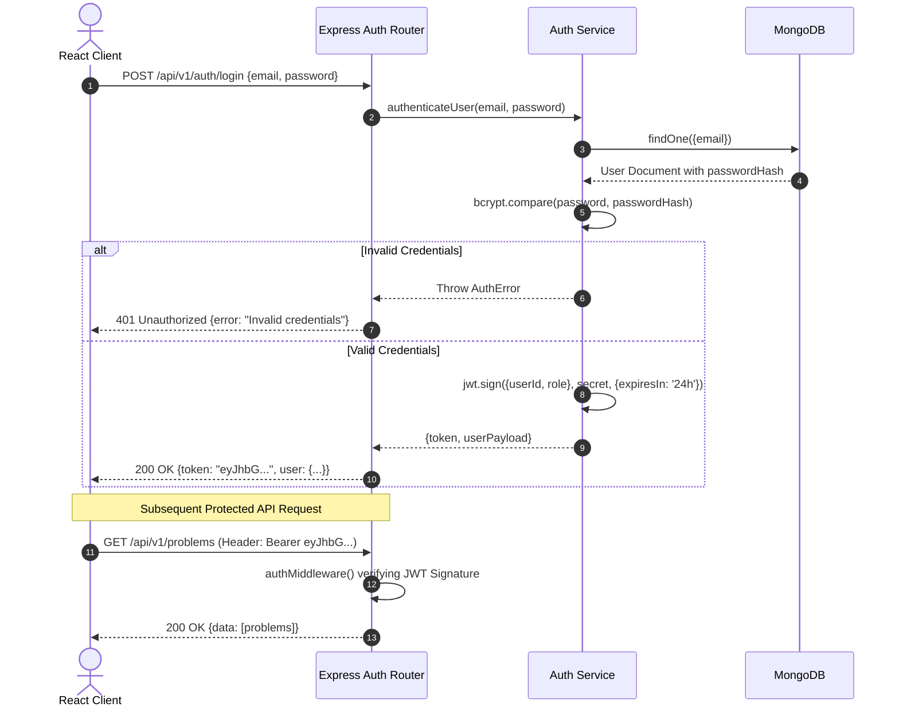
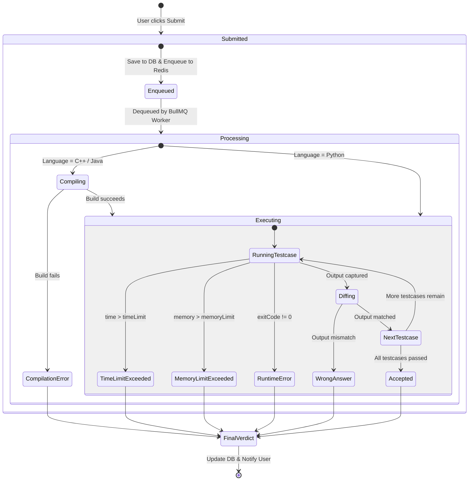
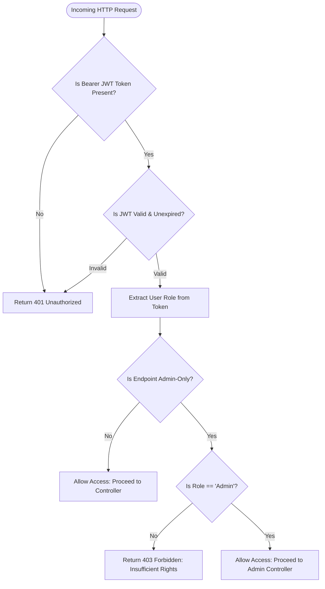
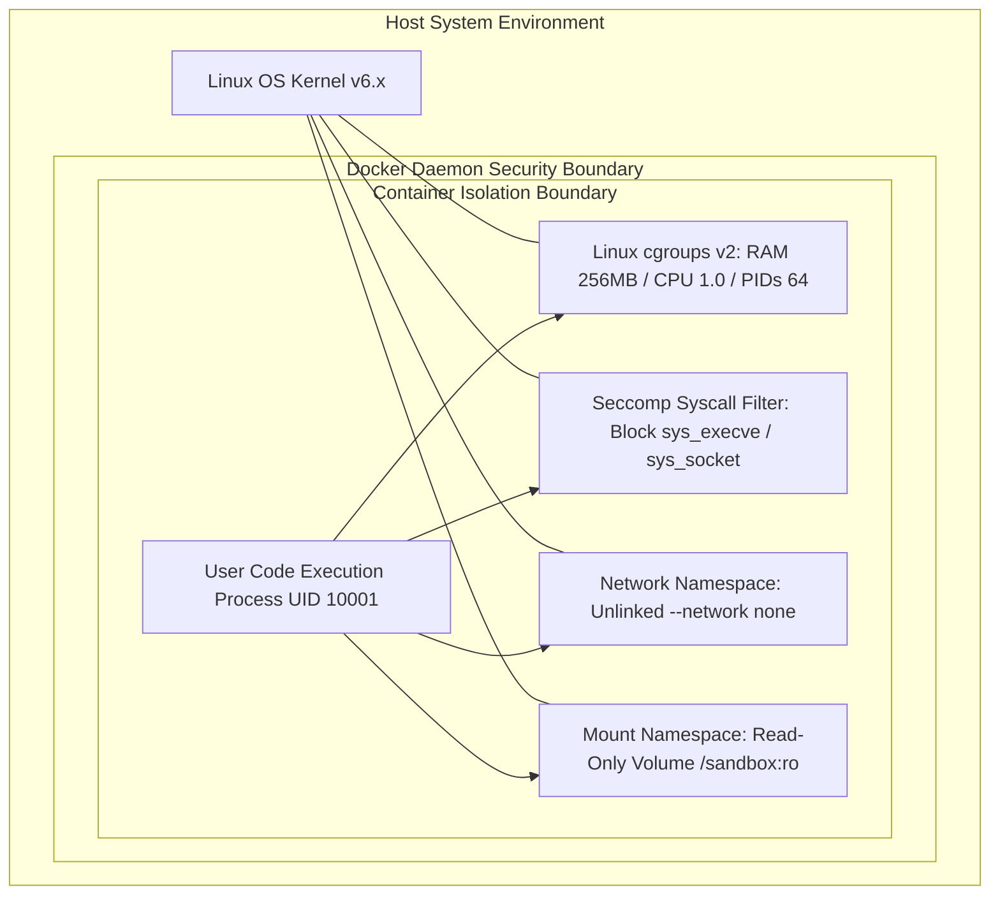
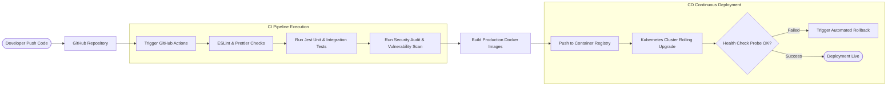

# System Diagrams Package
## Online Judge Platform — Architectural & Workflow Visualizations

---

| Document Metadata | Details |
| :--- | :--- |
| **Project Title** | Online Judge Platform |
| **Diagram Engine** | Native Mermaid JS Syntax |
| **Document Version** | 1.0.0-RELEASE |
| **Status** | Approved for Implementation |
| **Author** | **Kuswanth Tumma** |
| **Date** | July 2026 |

---

## 1. High-Level System Architecture Diagram



---

## 2. System Use Case Diagram



---

## 3. UML Class Diagram



---

## 4. System Component Diagram

```mermaid
componentDiagram
    package "Presentation Layer" {
        [React Client Component]
        [Monaco Code Editor]
    }

    package "API Gateway Layer" {
        [Authentication Controller]
        [Problem Controller]
        [Submission Controller]
        [JWT Middleware]
    }

    package "Async Messaging Layer" {
        [Redis Instance]
        [BullMQ Submission Queue]
    }

    package "Worker Compute Layer" {
        [BullMQ Worker Loop]
        [Docker Orchestrator Service]
        [Diff Evaluator Engine]
    }

    package "Storage Layer" {
        database "MongoDB Cluster"
    }

    [React Client Component] --> [JWT Middleware]
    [JWT Middleware] --> [Submission Controller]
    [Submission Controller] --> [BullMQ Submission Queue]
    [BullMQ Submission Queue] --> [BullMQ Worker Loop]
    [BullMQ Worker Loop] --> [Docker Orchestrator Service]
    [Docker Orchestrator Service] --> [Diff Evaluator Engine]
    [Diff Evaluator Engine] --> [MongoDB Cluster]
```

---

## 5. Production Infrastructure Deployment Diagram



---

## 6. Code Submission & Async Verdict Sequence Diagram



---

## 7. User Authentication & JWT Lifecycle Sequence Diagram



---

## 8. Code Submission Activity & Evaluation Lifecycle



---

## 9. Role-Based Access Control (RBAC) Flowchart



---

## 10. Docker Sandbox Security & Isolation Architecture



---

## 11. CI/CD Deployment Pipeline Flowchart


